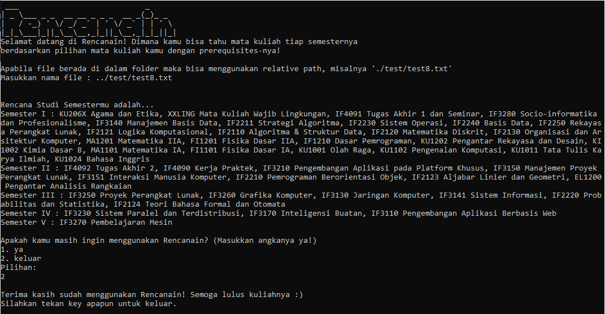
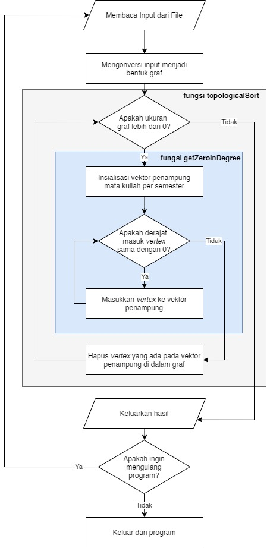

# Renacain : Program Pemilihan Rencana Kuliah
> Tugas Kecil 2 IF2211 Strategi Algoritma | 13519083 Shaffira Alya Mevia


*Screenshot Rencanain*

## Getting Started
Untuk menjalankan Rencanain dapat langsung *double-click* file `main_13519083.exe` pada folder bin. 

Apabila ingin menjalankan melalui terminal, bisa dengan menjalankan *command* berikut dari folder *root*.
```
.\bin\main_13519083.exe
```

## How Does It Work
Program ini bekerja dengan mengimplementasikan Topological Sort yang menggunakan konsep Algoritma Decrease and Conquer. File input (hanya menerima dengan format .txt) kemudian akan dikonversikan menjadi bentuk Graf dengan representasi Adjacency List. 

Konsep Algoritma Decrease and Conquer yang diimplementasikan adalah pada tahapan sorting secara topological. Ukuran dari graf akan selalu mengecil seiring berjalannya program dalam memilih mata kuliah mana saja yang akan masuk semester apa saja.

Berikut adalah flowchart dari Rencanain.



## Credits
Program ini dibuat oleh [@salyamevia](https://github.com/salyamevia) dengan beberapa sumber referensi | Februari 2021


